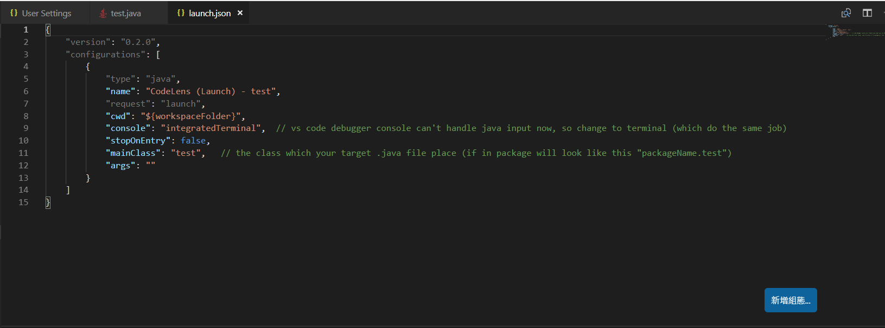

# 哈囉！學弟妹們～

## 這邊做一些補充, 還有[解決VS Code的debugger](#fix-vs-code-debbuger)問題

### PPT 遺漏事項  

#### 首先，ＰＰＴ網頁修好了，大家可以在[slides.csie.io/concepts](https://slides.csie.io/concepts)找到它

#### 然後，想補充一些忘記講的～～

1. 希望大家都要有一個Github帳號(Gitlab也可以)
2. 有看過猴子的可以考慮下載視覺化git流程軟體(e.g. sourse tree, github desktop)，幫助你測試git進階指令
3. Clean Code 有想到再做就好，不用太刻意、過猶不及；適時的註解會更棒！  

PS: 只有我覺得1.2.3.好像越來越大嗎？

## Fix VS Code debbuger

    問題發生的原因是：目前VS Code的內建debugger console沒辦法處理Java的input．  
  
  為了避免大家狀態不一致，我從頭開始．  

#### 首先，大家確認要有兩個擴充功能

    1. Debugger for Java  
    2. Java Extension Pack  

#### 其次，設定java jdk 路徑給VS Code

    step 1  
    打開 檔案 > 喜好 > 使用者設定  
    或使用 ctrl(command) + shift + P  輸入  'user setting'  
      
    step 2
    點選 右上角．．．按鈕（更多動作）> (打開setting.json)
      
    step 3  
    在右邊 user settings 大括弧內  加入最後一行
```json
    "java.home": "C:\\Program Files\\Java\\jdk-10.0.2\\",
```
    PS: mac OS  直接複製java jdk路徑就好
        windos  需要如上面，多加入一個反斜線(\)

#### 最後，更改偵錯的設定 launch.json  

確保有在一個資料夾中打開VS Code  

    點選左側欄內 偵錯圖示 > 點擊上方Debugg 旁的播放鍵
    或  更左邊一些的齒輪(設定launch.json)

這時會跳出launch.json檔案
PS: 這檔案是告訴VS Code 如何在“這個資料夾”內debug  

    檔案應該要長得像這樣．
    且更改兩處：
      1. console          // Change to integratedTerminal
      2. mainClass        // where ur main class in



雖然不知道你們能不能成功，反正我是成功了！  

如果覺得這個問題,非常困擾可以上去VS Code 的Github Issue 這個問題～～
// default debug console can't handle single java file input

說不定隔天就修好了～
