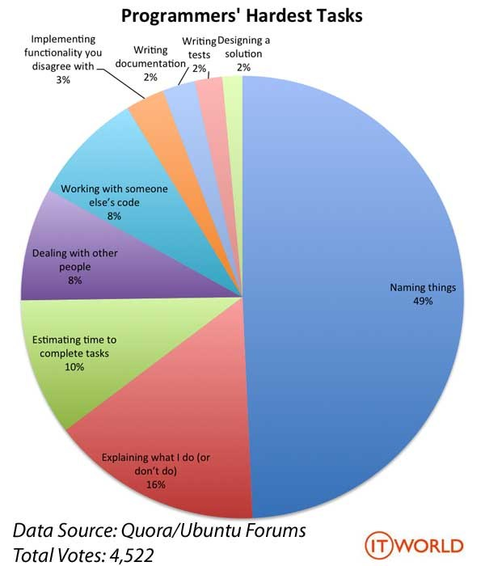

{{{
  
# Coding Style  

Clean Code

---  

- naming variable
- fortmat align
- variable case
- easy to understand
- comment & doc  
- use tools as well  
- don't afraid debug, enjoy it!

---  

## Why Clean Code  

<div style = "text-align: center; margin-top: 1em">
  “
        程式碼寫給誰看？  
           ”  
</div>  

---  

<div style="font-size:1.5em;">
    <h1>人</h1>
</div>  
  
---  

增進理解，養成好習慣  
  
<!-- the vote chart of hardest thing in coding  put last? -->  
  
}}}  

{{{  

## 命名東西  
  
永遠是最難的部分  
  
---  
  
  

---  

``` java  

// bad  
String a = "Hello";  
for (i = 0; i < 3; i++ ){  
  for (j = 0; j < 3; j++){  
    // do something  
  }  
}  
  
// good  
String greet = "Hello";  
for (row = 0; row < 3; row++ ){  
  for (column = 0; column < 3; column++){
        // do something  
  }  
}  

```  

}}}  
  
{{{  
  
## 格式對齊  

大家都要整整齊齊  

---

``` java
public static void main(){
    //  do somthing
    //  align with same indent
}

// also  
public static void main()
{
    //  do somthing
    //  indent same
}
```

}}}  
  
{{{

## 命名規則  

規則、共識

---

- Cases:
  - camelCase
  - PascalCase
  - kebab-case
  - Snake_case  

---

- 共識:
  - 依各語言而異
  - ex:  

``` java

  const int EYES = 2;

```

}}}

{{{

## 易於理解  

程式是給人讀的  

---

不要變魔術

```js
// swap foo & bar
foo = 2;
bar = 3;

// bad
foo ^= bar ^= foo ^= bar ;  

// good enough
temp = foo;
foo = bar;
bar = temp;  

```

---  

``` java
// reverse the string
String str = "hello";

for (i = 0; i < str.length / 2; i++)
    swap(str.[i], str.[str.length - i - 1]);

// better
str.split("")
      .reverse()
        .join("");
```

}}}

{{{  

## 註解、文件

助於理解  

---

過猶不及

``` java
// 請酌量取用
```

}}}  

{{{

## Debug

do not afraid, enjoy it.  

---  

有 bug提示 是件幸福的事  

---

## debug tips  

1. 了解錯誤
2. 大膽假設、小心求證

}}}

{{{

## Hardest part of Programming



---

1. 幫東西命名（Naming things）
2. 解釋自己做什麼（或不做什麼）（Explaining what I do (or don’t do)）
3. 估計工作完成的時間（Estimating time to complete tasks）
4. 和別人打交道（Dealing with other people）
5. 使用別人的程式碼進行工作（Working with someone else’s code）


}}}

{{{

# Tools

- vs code
- git

---

## vs code 

+ auto-fillin
+ plug-ins
+ shortcut
+ features
  + gits
  + debugger
  + live-sharing

---

## Git 

版本控制

---

[連猴子都懂得Git](https://backlog.com/git-tutorial/tw/ )

}}}